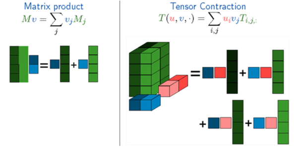

基本概念
===

TF的核心是围绕Graph展开的，简而言之，就是Tensor沿着Graph传递闭包完成Flow的过程。所以在介绍Graph之前需要讲述一下符号编程、计算流图、梯度计算、控制流的概念。

# Tensor
在数学上，Matrix表示二维线性映射，Tensor表示多维线性映射，Tensor是对Matrix的泛化，可以表示1-dim、2-dim、N-dim的高维空间。下图对比了矩
阵乘法（Matrix Product）和张量积（Tensor Contract），可以看出Tensor的泛化能力，其中张量积运算在TF的MatMul和Conv2D运算中都有用到，Tensor
在高维空间数学运算比Matrix计算复杂，计算量也非常大，加速张量并行运算是TF优先考虑的问题，如add, contract, slice, reshape, reduce, 
shuffle等运算。

TF中Tensor的维数描述为阶，数值是0阶，向量是1阶，矩阵是2阶，以此类推，可以表示n阶高维数据。

TF中Tensor支持的数据类型有很多，如tf.float16, tf.float32, tf.float64, tf.uint8, tf.int8, tf.int16, tf.int32, tf.int64,
tf.string, tf.bool, tf.complex64等，所有Tensor运算都使用泛化的数据类型表示。

# 算子(operation)

在TF的实现中，机器学习算法被表达成图，图中的节点是算子(operation)，节点会有0到多个输出.

# 核(kernel)

TF中还有一个概念是kernel，kernel是operation在某种设备上的具体实现。TF的库通过注册机制来定义op和kernel，所以可以通过链接一个其他的库来进行kernel和op的扩展。

# 边(edge)

TF的图中的边分为两种：

正常边，正常边上可以流动数据，即正常边就是tensor
特殊边，又称作控制依赖，(control dependencies)

没有数据从特殊边上流动，但是特殊边却可以控制节点之间的依赖关系，在特殊边的起始节点完成运算之前，特殊边的结束节点不会被执行。

也不仅仅非得有依赖关系才可以用特殊边，还可以有其他用法，比如为了控制内存的时候，可以让两个实际上并没有前后依赖关系的运算分开执行。

特殊边可以在client端被直接使用

# 会话(Session)

客户端使用会话来和TF系统交互，一般的模式是，建立会话，此时会生成一张空图；在会话中添加节点和边，形成一张图，然后执行。

# 变量(Variables)

机器学习算法都会有参数，而参数的状态是需要保存的。而参数是在图中有其固定的位置的，不能像普通数据那样正常流动。因而，TF中将Variables实现为一个特殊的算子，该算子会返回它所保存的可变tensor的句柄。